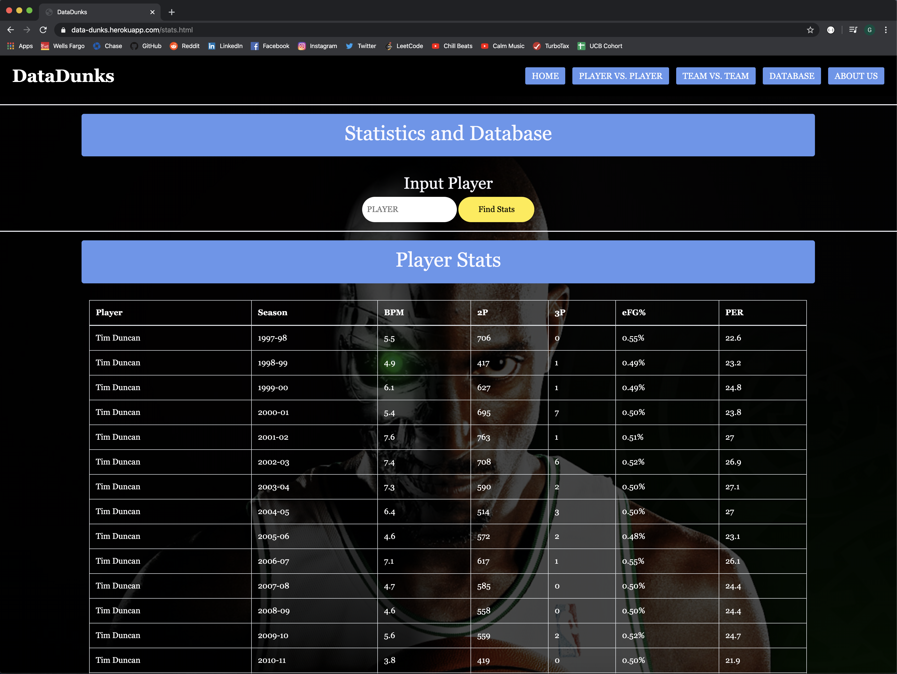

# Data-Dunks

Project: DataDunks
https://data-dunks.herokuapp.com/

We are proud to name this project our first accomplished application on our endeavors to become Data Scientists. Data was scraped from https://www.nba.com/ and https://www.basketball-reference.com/ then altered using Python, HTML, CSS, and Javascript. The end results is a simulated web application where users can input their favorite basketball players to "compete" in matches consisting of One vs. One or Team vs. Team. This website also contains a sub-section where users can input any player in the dataset and discover their best seasons statistics. More information can be found on the "About Us" page within the application. Enjoy!

------------------------------------------------------------------------------------------------------------------------

# Below is a preview of the web application

### Home Page

### Player vs Player

### Team vs Team

### Database

### Python Scraping Code

### HTML and CSS

